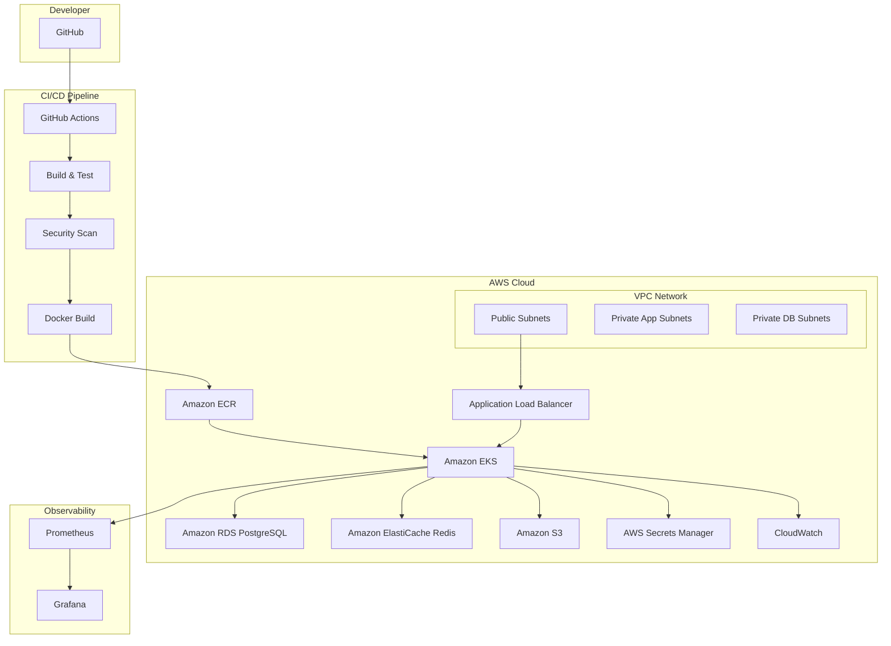

# AWS Cloud Platform

A production-grade cloud platform demonstrating modern DevOps, cloud engineering, and infrastructure practices on Amazon Web Services (AWS).

## Purpose

This project serves as a professional portfolio demonstrating practical, hands-on experience with:

- Infrastructure as Code (Terraform)
- Container orchestration (Amazon EKS, Kubernetes, Helm)
- CI/CD automation (GitHub Actions, GitHub OIDC)
- Cloud security (IAM, Secrets Manager, least privilege)
- Observability (CloudWatch, Prometheus, Grafana)
- Reliability engineering (multi-AZ, backups, disaster recovery)
- Cost optimization and operational excellence

## Business Context

Modern organizations require cloud platforms that are secure, scalable, observable, and cost-efficient. This project demonstrates the engineering capabilities needed to design, build, and operate such platforms in production environments.

## Engineering Goals

1. **Infrastructure as Code**: All AWS resources defined and versioned in Terraform
2. **Security First**: No hardcoded secrets, least-privilege IAM, encrypted data at rest and in transit
3. **Observability**: Comprehensive monitoring, logging, and alerting
4. **High Availability**: Multi-AZ deployment with automated failover considerations
5. **Operational Excellence**: Documented runbooks, disaster recovery, and cost controls
6. **GitOps-Ready**: Automated CI/CD with security scanning and deployment verification

## Architecture Overview



## Technology Stack

| Layer | Technology |
|-------|-----------|
| Application | Java 21, Spring Boot 3, Maven |
| Database | PostgreSQL (Amazon RDS) |
| Cache | Redis (Amazon ElastiCache) |
| Storage | Amazon S3 |
| Containers | Docker |
| Orchestration | Kubernetes, Amazon EKS, Helm |
| Infrastructure | Terraform |
| CI/CD | GitHub Actions, GitHub OIDC |
| Registry | Amazon ECR |
| Load Balancing | AWS Application Load Balancer |
| Security | AWS IAM, AWS Secrets Manager, AWS KMS |
| Observability | CloudWatch, Prometheus, Grafana, Micrometer |
| Security Scanning | Trivy, Gitleaks |

## Repository Structure

```
aws-cloud-platform/
├── application/          # Java Spring Boot application
├── terraform/            # Infrastructure as Code
│   ├── modules/          # Reusable Terraform modules
│   └── environments/     # Environment-specific configurations
├── kubernetes/           # Kubernetes manifests
├── helm/                 # Helm charts
├── monitoring/           # Prometheus/Grafana configurations
├── scripts/              # Operational scripts
├── docs/                 # Documentation
│   ├── architecture/
│   ├── networking/
│   ├── security/
│   ├── operations/
│   ├── disaster-recovery/
│   └── cost-optimization/
├── .github/              # GitHub Actions and templates
└── README.md
```

## Development Roadmap

| Phase | Description | Status |
|-------|-------------|--------|
| 1 | Repository Foundation | In Progress |
| 2 | Spring Boot Application | Planned |
| 3 | Local Development Environment | Planned |
| 4 | Terraform Foundation | Planned |
| 5 | AWS Networking (VPC, Subnets, NAT) | Planned |
| 6 | Amazon ECR | Planned |
| 7 | Amazon EKS | Planned |
| 8 | Amazon RDS PostgreSQL | Planned |
| 9 | Amazon ElastiCache Redis | Planned |
| 10 | Amazon S3 | Planned |
| 11 | Kubernetes Deployment | Planned |
| 12 | Helm Packaging | Planned |
| 13 | Observability | Planned |
| 14 | Security Controls | Planned |
| 15 | GitHub Actions CI | Planned |
| 16 | GitHub Actions CD | Planned |
| 17 | Disaster Recovery | Planned |
| 18 | Cost Optimization | Planned |
| 19 | Production Readiness Review | Planned |
| 20 | Final Documentation | Planned |

## Conventional Commits

This project uses [Conventional Commits](https://www.conventionalcommits.org/) for clear and structured commit history.

See [docs/operations/conventional-commits.md](docs/operations/conventional-commits.md) for details.

## License

This project is licensed under the MIT License - see [LICENSE](LICENSE).

## Contact

**Bruna Lissa de Almeida**
- GitHub: [@brunalissa](https://github.com/brunalissa)
- Email: brubsalmeida0@gmail.com

---

> **Note**: This is a portfolio project for demonstrating cloud engineering and DevOps skills. Infrastructure is defined as code but not automatically deployed to avoid unexpected AWS charges.
